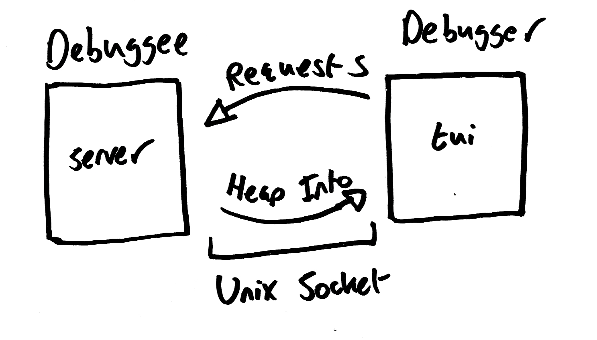
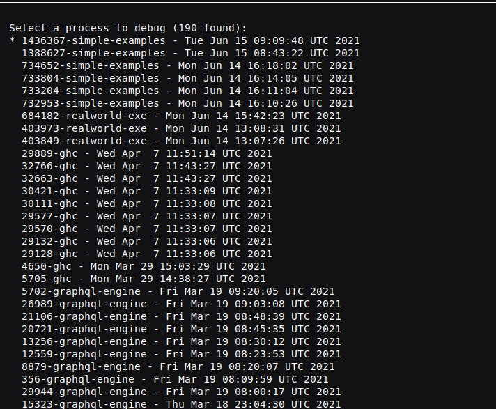
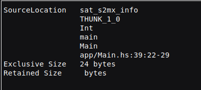
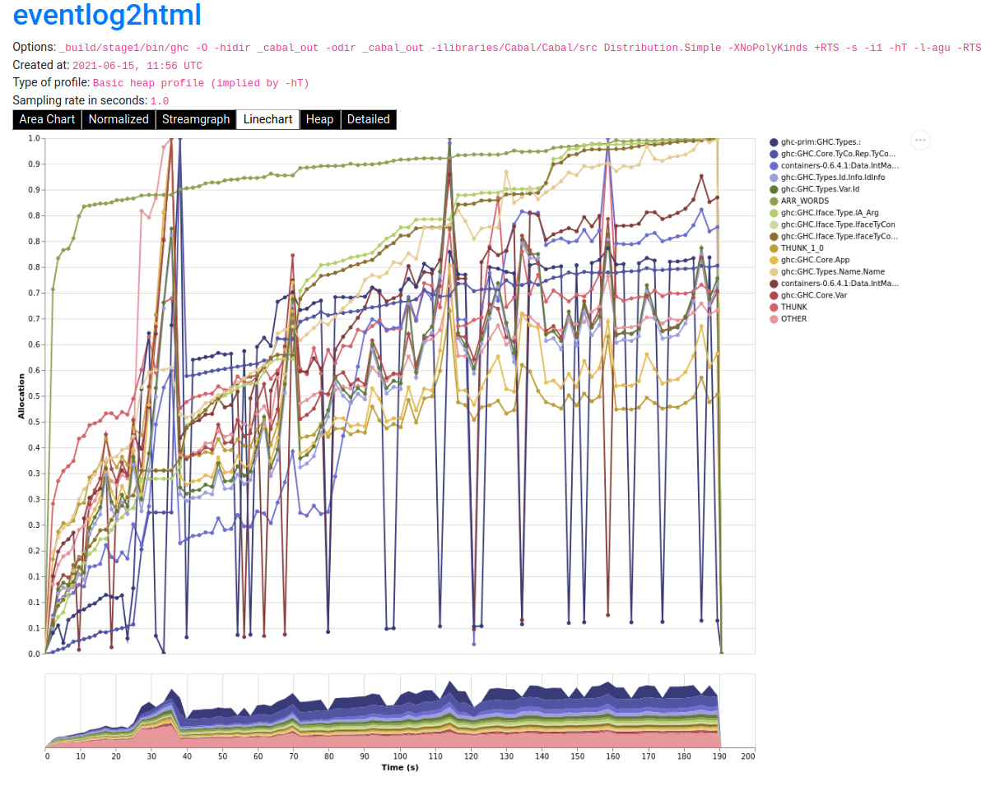
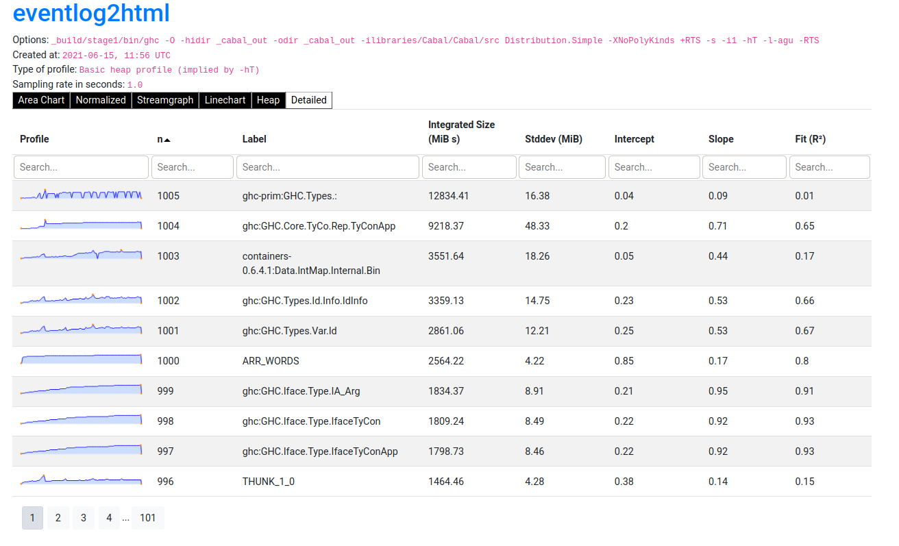
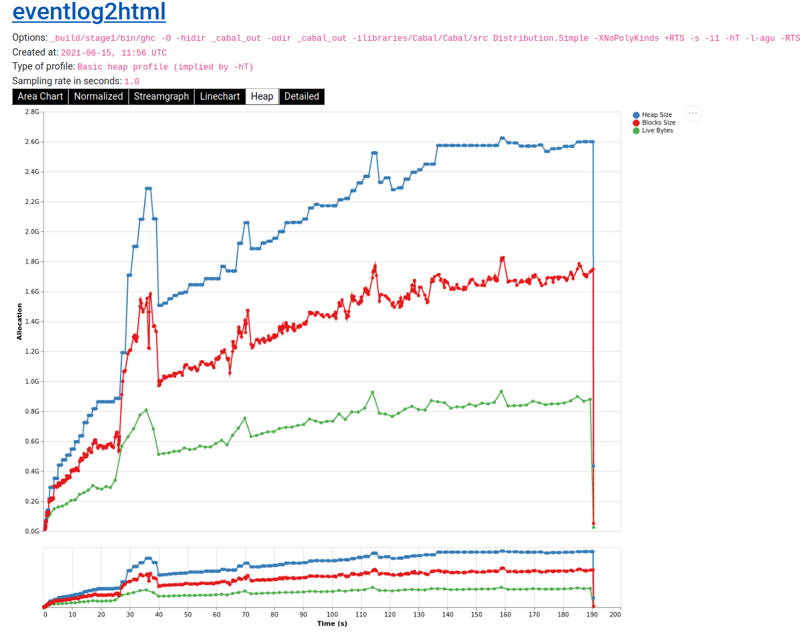
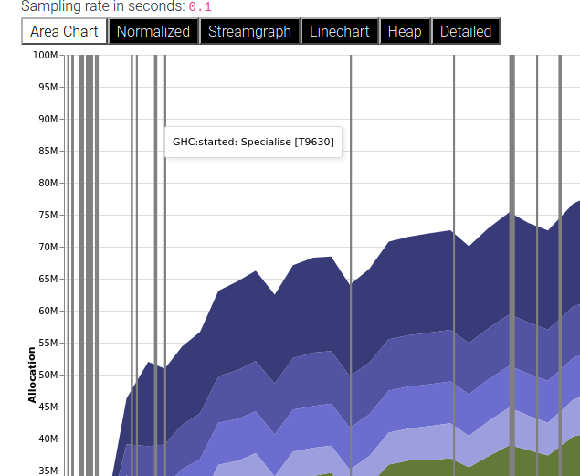

# Introduction

This workshop will introduce two tools for profiling Haskell programs, eventlog2html
and ghc-debug. These form a family of new heap profiling tools which use
the new [info table location](https://well-typed.com/blog/2021/01/first-look-at-hi-profiling-mode/) feature in GHC 9.2. The info table locations allow a debugger to very precisely map
a source of allocation to a place in the source program. This gives much more detailed
and actionable profiling output.

The workshop is intended to be interactive, follow along and get familiar with
running the tools for yourself.

No advanced knowledge of language features is necessary, but you shouldn't
be afraid of internal implementation details. It is also a bit fiddly to set-up the
correct environment.

# Pre-tutorial

Before the workshop, you should have the following installed:

* jq
* ghc-9.2 (https://downloads.haskell.org/~ghc/9.2.1-alpha2/)
* cabal-3.6 (https://github.com/haskell/cabal/tree/3.6)
* eventlog2html-0.9 (`cabal install eventlog2html-0.9`)
* docker

Or, alternatively, use this `nix` invocation to set-up the environment.

```
nix-shell
```

# Part 1: Introduction to RTS and ghc-debug

In order to effectively profile a Haskell application it's very useful to have a mental
model of how values are represented at runtime. Heap profiling tools are just ways
to visualise this information, so unless you have at least a basic understanding of
what they are trying to visualise then making progress with a heap profile can
be very tricky.

## Generational Scheme

Nursery -> Gen0 -> Gen1

## Block Structure

## Closure Structure

### Standard Closure Layout

Most Haskell values are represented in a uniform way.


### Stack Closures

### A selection of other closure types

## Info Table Profiling

* (Ben) Basic heap layout principles, strucutre of closures, what is an info table, what do thunks look like
* (Ben) Basics of memory usage, difference between blocks allocated, mblocks allocated, live bytes
* (Ben) Explanation of info table profiling

## What are profiling tools?

Heap profiling tools allow you to answer questions about live memory on the heap.
With a heap profiling tool you can understand both high and low-level questions about
memory usage. It's normally useful to start by asking high-level questions:

* Is the memory usage of my application increasing over time?
* Are there any particuar source of allocations or closure types which account
  for a high percentage of residency?
* Are there any obvious memory usage spikes visible in the profile?

These are questions that tools like `eventlog2html` can answer.

After asking a high-level question, and getting an idea where the problem is,
you can start asking low-level questions in order to properly

* What is retaining a specific part of memory which is leaking?
* What's the structure of the objects which are contributing a lot to residency?
* How does the memory usage differ between these two points in my program?
* What source position contributes the most to allocation in the program?

These low-level questions are ones which are hard to answer with `eventlog2html`
but easy to answer with `ghc-debug`. A mastery of both tools can lead to enlightenment.

# Part 1a: Getting going with ghc-debug

[ghc-debug](https://gitlab.haskell.org/ghc/ghc-debug) is a suite of applications and libraries which allow you to inspect
the heap as a Haskell application from a debugger written in Haskell. The
heap structure is represented using Haskell datatypes and traversal functions
written using normal recursive Haskell traversal functions.

Debugging an application has two parts:

1. Instrument the `main` function of your application using a simple wrapper.
   When the program starts a socket will be created, which a debugger can
   connect to and query information about the heap.
2. Write a debugging script which connects to the opened socket, and queries
   and analyses information about the heap.

A key design principle of ghc-debug is that the debugger doesn't run in the same
process as your application. Therefore, there are no instrumentation artefacts
present in the profiles. When a debugger connects to your process, it pauses it
and therefore the heap won't mutate throughout the run of your debugging script.
This is critical to be able to traverse stack closures properly.



### Q: How is ghc-debug different to ghc-heap?

ghc-heap is limited to decoding normal closures, it can't traverse stack frames
and therefore a full heap traversal is not possible. ghc-heap runs in-process and
the instrumentation can affect the heap structure, for example, if you not careful then forcing
particular values while analysing them can lead to false analysis results.


## Simple examples with the TUI

To get us thinking a bit more closely about what things on the heap look like,
we're going to try some simple examples using `ghc-debug-tui`. The examples
should help test some of your intuitions about how simple Haskell values are
represented on the heap.

The examples are in `simple/app/Main.hs`. In one terminal run:

```
> cabal run simple
Enter a number:
100
Pausing for interruption by ghc-debug
```

And then in another terminal you can launch the tui to inspect the heap of the
running program.

```
> cabal run tui
```

When the TUI starts, the dialog will list the sockets which it has found by looking
in `$XDG_DATA_DIR/ghc-debug/debuggee/`. The socket is opened by the call to `withGhcDebug` in
`App.hs`.



After the right socket has been selected, the pause request can be sent to the
process. The debugger then requests the GC roots for the process and renders them
in a list.


At the top of the list you can see the saved objects from the examples.
Hovering over the first object you can see the source position the thunk arose
from.



Looking through the different examples you can tune your expectation about
how objects are laid out on the heap.


### Summary

At the moment the TUI is more of an exploratory toy than a serious debugging application.
For serious debugging you should write your own debugging scripts, which we will
get onto later.

# Part 2: Using eventlog2html

If you are trying to debug the memory usage of a large application then
you can't get stuck into the nitty-gritty straight away, there's too much information.
You first need to get a high-level overview of what's going on, and that's what
`eventlog2html` is for.


## Heap Profiling

GHC has a built-in heap profiler which can be used to obtain a high-level overview
of the memory usage of your program. The heap profiler is a sampling profiler,
at a predetermined interval the execution of your program is stopped, the profiler
traverses the whole heap and then reports a summary of what's there depending
on the profiling mode.

The samples are then emitted into the eventlog, the eventlog can then be processed
by `eventlog2html` in order to create a human readable profile. The result is
an interactive HTML page with several different renderings of the profile samples.

<screenshot>

We're going to focus on two modes in particular because they do **not** require your
application to be rebuilt in the profiling way. In order to use one of these heap
profiling modes you just pass `+RTS -hT/-hi` when running your application.

<dl>
  <dt>Profile by closure type (<code>-hT</code>)</dt>
  <dd>Each bucket corresponds to a different <a href="https://hackage.haskell.org/package/ghc-heap-9.0.1/docs/GHC-Exts-Heap-ClosureTypes.html"> closure type </a>. This provides a high-level view of whether the memory is used by constructors, functions, thunks, stack frames and so on. </dd>
  <dt>Profile by info table (<code>-hi</code>)</dt>
  <dd>Each bucket correponds to a distinct info table, each thunk, function, data constructor
      gets it's own info table so this provices very precise information.</dd>
</dl>

## Eventlog Basics

The eventlog is a file produced by the RTS which logs specific events as they
happen in the RTS.

In order to use the eventlog:

1. Compile your application with `-eventlog`
2. Run your application with `+RTS -l`.

The result will be a file called \<executable\>.eventlog which contains information about
RTS events, such as, how much memory was used, when GC happened, information about
threads and crucially for us, information about heap profiling samples.

#### Aside: What is the profiling way?

It's maybe a bit confusing that we can perform two modes of heap profiling without
building with the profiling way. The profiling way is primarily meant to
support *cost centre profiling*.

An issue with the profiling way is that because it inserts cost centres into your
program before optimisation, this can affect how the program is optimised. A program
built with the profiling way will also use more memory as the standard heap layout
contains an extra word per closure.

#### Aside: Increase the sample interval for programs

If you program has a large residency (> 1GB) then the default profiling interval (0.1s) is
too low and will cause your program to take a long time to complete. You can increase the
profiling interval by passing the `-i` flag. I find setting the interval to 1s is a
good compromise between an informative profile and a speedy finish.

## Profiling by closure type (`-hT`)

Profiling by closure type is a great way to get a high-level overview of
the heap usage of your program. In order to generate the closure type profile you
run your executable with the `-hT` option.

```
my-executable +RTS -hT -l
```

The resulting eventlog can then be converted into a html file using `eventlog2html`.

```
eventlog2html my-executable.eventlog
```

Example: Profiling ghc building Cabal

#### Interpreting the profile

The default view of the profile shows the 10 bands with the largest total area.
This highlights bands which have had consistently high memory usage throughout
the program. There are 4 panes which display the heap profile in slightly different
ways.

### Area Chart

The area chart is the normal way to view a chart. The x-axis shows elapsed time
and y-axis shows residency. Each band is stacked on top of the others, by default
the top 15 bands are showed explicitly and the rest of samples grouped into other.


This view is very similar to the view provided by `hp2ps` and `hp2pretty`.

### Linechart

The linechart view shows normalised residency over time. Each residency band
is normalised to a percentage of the maximum value for that band. Therefore a value
of 1 indicates that at that time point, the residency of that band was the most
throughout the whole profile run.



This view can help pick out slowly increasing bands from the noise of bands
which fluctuate a lot over time. A band which is slowly increasing is indicative
of a leak and requires further investigation.


### The detailed pane

A recent addition to `eventlog2html` is the "detailed" pane. This provides
a summary of each band in the profile.



What does each band mean in the detailed pane?


<dl>
  <dt>Profile</dt>
  <dd>A sparkline chart showing the residency over time</dd>
  <dt>n</dt>
  <dd>The "ranking" of the band by the integrated size</dd>
  <dt>Label</dt>
  <dd>A human readable label for the band</dd>
  <dt>Integrated Size</dt>
  <dd>The total area under the residency graph</dd>
  <dt>Stddev</dt>
  <dd>The standard deviation of the samples</dd>
  <dt>Intercept</dt>
  <dd>The intercept of the line of best fit calculated by least squares regression</dd>
  <dt>Slope</dt>
  <dd>The slope of the line calculated by least sequares regression</dd>
  <dt>Fit</dt>
  <dd>How well the regression fits the points</dd>
</dl>


The detailed pane is useful for several reasons.

1. You can easily identify each band of residency and consider it in turn.
2. You can see sources of residency which are too small to appear
3. You can search the bands to find specific sources of interest. For example,
   the allocations from a certain constructor.
4. Patterns between different bands can be identified by eye.

Something I regularly do is go to the detailed pane, and click through each
page looking to see if there are common patterns. Once getting to the smaller bands
this can be particularlly useful because small bands are often not polluted to
the same extent as large bands. For example, your profile might contain contribution
of ARR_WORDS from many different sources but there's likely to be a correlated
band further down the profile for `ByteString` or another wrapper type.

> The root cause of memory issues is not usually the biggest band in the profile

Another trick is to sort by the "slope" column to find bands which have high slope
value, these ones are bands which increase steadily over time and might indicate leaks.

#### The heap pane

The heap pane shows information about memory:



* Live bytes: Green line: Amount of live data (should match top of area pane)
* Blocks Size: Red line: Total size of allocated blocks
* Heap Size: Blue Line: Total size of allocated megablocks

OS memory usage corresponds roughly to the heap size, and the size of the nursery
is approximatey the difference between the red and blue lines.

This view can also be useful in identifying back fragmentation situations. A
very badly fragmented heap will have low live bytes (green) bit much higher
blocks size (red line).


### Adding markers

Markers can also be emitted to the eventlog to mark specific points in the program.
These markers will also be rendered on the profile so execution time can be
correlated with human understandable events.



```
import Debug.Trace

traceMarkerIO :: String -> IO ()
```

Some applications (such as `ghc -ddump-timings`) produce a large number of
markers so it's necessary to filter the markers before displaying them on
the profile or the output is unreadable.


#### Filtering markers

There are three options for controlling the display of traces on the chart.

    --no-traces will remove all traces from the chart.
    -i SUBSTRING will keep traces which contain the given substring.
    -x SUBSTRING will remove traces which contain a given substring.

If a trace matches both an -i and an -x option then it is included in the chart.

## Profiling by Info Table (`-hi`)


## Summary

Now we understand how to create and interpret a heap profile using a combination
of the eventlog and eventlog2html. This provides a high-level overview of
your programs memory usage.

### Exercise: Profiling an application

We have prepared a simple server application which might have some memory issues
to investigate with eventlog2html and ghc-debug. The application is in the
`haskell-scotty-realworld-example-app` directory. The application is an implementation
of the [realworld example application](https://github.com/gothinkster/realworld), it's
a simple medium.com clone which has endpoints for registering users, creating articles
and writing comments.

There are three scripts to interact with the example application.

```
# Start the docker container for postgres
./start_postgres

# Start the server (a wrapper around cabal run)
./run_server

# Issue dummy requests which creates 1000 articles
./run
```

The exercise is to profile the application. Keep reading if you need more help!


### Troubleshooting

Q: How do I enable profiling?

1. Add `-eventlog` to the `ghc-options` of the cabal file
2. Modify the `./run_server` script to pass the relevant profiling options.
3. Run the server, the eventlog will be produced at `realworld.eventlog`
4. Visualise the eventlog with `eventlog2html`, what do you see?

Q: Passing options to an executable with `cabal run`

Options can be passed to an executable invoked by `cabal run` by specifying the
arguments after `--`.

```
cabal run exe -- args for exe here
```

Q: Why is my profile truncated.

The eventlog output is buffered, stop the server before rendering the profile.
There is also a new option `--eventlog-flush-interval=1`, which can be used to flush
the eventlog at a certain interval in seconds.


* Demonstrating using eventlog2html on an example, profiling building (Cabal).
* Explain the build options which are needed to build with eventlog enabled.
* Explain the two different profiling modes `-hT` and `-hi`.
* Explain the user interface of eventlog2html
  - Area vs Linechart views
  - Heap view
  - Detailed View
* Discussion about Detailed View, examples of searching
* Compare and constrast `-hT` and `-hi` mode. High-level vs detailed

* (Interactive) Use eventlog2html on the sample application
* What do we observe?

# Part 3a: Using ghc-debug on a bigger application

ghc-debug is best suited for precise analysis of memory usage once you have
formulated a precise question to ask. The normal way to use ghc-debug is
to write a little debugger script using the library functions which summarises
the heap in a domain-specific way.


## Instrumenting an application for ghc-debug

Instrumenting an application so it be controlled by a debugger is easy.
The `GHC.Debug.Stub` module exports the `withGhcDebug` wrapper which opens
the socket.

```
import GHC.Debug.Stub

-- withGhcDebug :: IO a -> IO a

main = withGhcDebug $ do ...
```

Now when the application is started, a socket will be opened which can be connected
to by a debugger.

NOTE: The `GHC_DEBUG_SOCKET` variable controls the socket which the debuggee
creates the socket on.

## Writing a Debugger

A debugger is a Haskell program which connects to the socket and then takes
control of the program. Once in control of a program, there are a number of
requests which can be issued in order to learn information about the heap. Together
they can be used to perform a complete heap traversal.

There is a simple debugger in `debugger/`.

```
{-# LANGUAGE TupleSections #-}
module Main where

import GHC.Debug.Client
import GHC.Debug.Count

main :: IO ()
main = withDebuggeeConnect "/tmp/ghc-debug" prog

prog :: Debuggee -> IO ()
prog e = do
  pause e
  res <- run e $ do
    rs <- gcRoots
    count rs
  resume e
  print res
```

The debugger starts by connecting to the socket which is located at `/tmp/ghc-debug`.
Once connected, the program `prog` is executed. This program traverses the whole
heap and reports how many closures there are live on the heap.

1. The program starts by `pause`ing the application
2. Once the application is paused, we can start issuing requests to the program.
   First the `gcRoots :: DebugM [ClosurePtr]` are requested.
3. The `count :: [ClosurePtr] -> DebugM CensusStats` function is a built-in traversal which counts the number and size of
   reachable closures.
4. The `run :: Debuggee -> DebugM a -> IO a` function executates the analysis.
5. The analysed program is then resumed `resume :: Debuggee -> IO ()`.
6. Before finally the result of the census is printed.

The debugger can be run with:

```
cabal run debugger
```

### Haskell Representation

Closures are represented as a Haskell data type called [`DebugClosure`](https://hackage.haskell.org/package/ghc-debug-common-0.1.0.0/docs/GHC-Debug-Types-Closures.html#t:DebugClosure).
There's a constructor for each of the different closure types, traversals of
the heap can be written as normal Haskell functions in terms of the `DebugClosure`
data type!

### Analysis Scripts

Documentation for some common analysis modes is in [ghc-debug-client](https://hackage.haskell.org/package/ghc-debug-client-0.1.0.0)

| Module  | Description |
| ------------- | ------------- |
| [GHC.Debug.GML](https://hackage.haskell.org/package/ghc-debug-client-0.1.0.0/docs/GHC-Debug-GML.html)  | Export a heap graph to the GML format for further analysis. |
| [GHC.Debug.ObjectEquiv](https://hackage.haskell.org/package/ghc-debug-client-0.1.0.0/docs/GHC-Debug-ObjectEquiv.html)  |  Attempt to find identical closures which could be shared to save space  |
| [GHC.Debug.Profile](https://hackage.haskell.org/package/ghc-debug-client-0.1.0.0/docs/GHC-Debug-Profile.html)  |  Functions for performing whole heap census in the style of the normal -hT heap profiling |
| [GHC.Debug.Retainers](https://hackage.haskell.org/package/ghc-debug-client-0.1.0.0/docs/GHC-Debug-Retainers.html)  |  Functions for finding out what is retaining a specific closure |
| [GHC.Debug.Snapshot](https://hackage.haskell.org/package/ghc-debug-client-0.1.0.0/docs/GHC-Debug-Snapshot.html) | Create a snapshot so analysis can be performed without a running process |
| [GHC.Debug.TypePointsFrom](https://hackage.haskell.org/package/ghc-debug-client-0.1.0.0/docs/GHC-Debug-TypePointsFrom.html) | Create a "type points from" census in the style of [Cork](https://dl.acm.org/doi/10.1145/1190216.1190224) |

## Finding Retainers

The killer application of ghc-debug is finding out what is retaining specific closures.
For example, using ghc-debug you can answer questions such as what is the precise
path from a GC root to a certain closure. This information is usually very informative and by
reading the path you can understand why something is being retained very easily.

As with most analysis modes in ghc-debug, there is a familar pattern to the analysis.

1. Pause the program
2. Traverse the heap to find the information which you care about
3. Unpause the program
4. Render the information to the user.

Here is a sample analysis script for finding retainers of a constructor called
"Foo":

```
retainers :: Debuggee -> IO ()
retainers e = do
  pause e
  res <- run e $ do
    roots <- gcRoots
    rs <- tyConApp roots
    traverse (\c -> (show (head c),) <$> (addLocationToStack c)) rs
  resume e
  displayRetainerStack res

tyConApp :: [ClosurePtr] -> DebugM [[ClosurePtr]]
tyConApp rroots = findRetainers (Just 100) rroots go
  where
    go cp sc =
      case noSize sc of
        ConstrClosure _ ps _ cd -> do
          ConstrDesc _ _  cname <- dereferenceConDesc cd
          return $ cname == "TyConApp"
        _ -> return $ False
```

The script follows the same structure as the previous ghc-debug program. Now instead
of calling `count` the `tyConApp` function calls the library function `findRetainers`.

```
findRetainers :: Maybe Int
              -> [ClosurePtr]
              -> (ClosurePtr -> SizedClosure -> DebugM Bool)
              -> DebugM [[ClosurePtr]]
```

`findRetainers` starts traversing the heap from the given set of roots. At each
closure it encounters the predicate function is applied, if the predicate is
true then the path to that closure is returned.
When also passed a limit, the function will stop after finding |k|
closures matching the predicate.


The `go` function is the predicate function which is applied  on each closure on the heap.
It checks to see if the closure in question is a constructor closure and whether the
name of the constructor matches `Foo`.

Once the retainer stack is returned, it's useful to first call the `addLocationToStack`
function, which annotates the stack with source locations, the annotated stack can then
be printed by the `displayRetainerStack` function.

```
addLocationToStack :: [ClosurePtr] -> DebugM [(SizedClosureC, Maybe SourceInformation)]
displayRetainerStack :: [(String, [(SizedClosureC, Maybe SourceInformation)])] -> IO ()
```

The output of this function leaves a little to be desired but contains a wealth of
information.

```
"0x4225a44120"
TyConApp 0x42884b6260 0x4225a44a68 <:GHC.Core.TyCo.Rep:compiler/GHC/Core/TyCo/Rep.hs:1029:20-22>
Id 0x4241352d58 0x4225a44120 0x7fa762bf06c0 0x7fa764861480 0x7fa76478eeb0 0x420ea9f9e8 6341068275337658638 <:GHC.Core.Opt.Simplify:compiler/GHC/Core/Opt/Simplify.hs:(781,9)-(793,67)>
Tip 0x420ea9fa38 6341068275337658638 <:Data.IntMap.Internal:libraries/containers/containers/src/Data/IntMap/Internal.hs:838:27>
Bin 0x422606d488 0x420eaa0328 6341068275337658368 256 <:Data.IntMap.Internal:libraries/containers/containers/src/Data/IntMap/Internal.hs:835:21-44>
Bin 0x422606d4a0 0x422607ea10 4611686018427387904 2305843009213693952 <:Data.IntMap.Internal:libraries/containers/containers/src/Data/IntMap/Internal.hs:836:21-44>
Bin 0x4283d20530 0x422607ea38 0 4611686018427387904 <:Data.IntMap.Internal:libraries/containers/containers/src/Data/IntMap/Internal.hs:836:21-44>
_bh 0x422607ea60 <nl>
SimplEnv 0x42130cabd0 0x7fa7505d5ae8 0x7fa7505d5ae8 0x422607d550 0x422607d530 <:GHC.Core.Opt.Simplify.Env:compiler/GHC/Core/Opt/Simplify/Env.hs:(806,1)-(829,41)>
_thunk(  ) 0x422607d578 0x422607e4b0 <Unfolding:GHC.Core.Opt.Simplify:compiler/GHC/Core/Opt/Simplify.hs:3004:14-48>
IdInfo 0x7fa764790090 0x422607e6b0 0x7fa764713410 0x7fa76470e360 0x7fa764744068 0x7fa764741618 0x7fa764744930 0x7fa74f112478 0 <:GHC.Core.Opt.Simplify:compiler/GHC/Core/Opt/Simplify.hs:3005:54-64>
Id 0x4234a4e600 0x4234a4e5a8 0x7fa762bf06c0 0x7fa764861480 0x7fa76478eeb0 0x422607e850 6341068275337658369 <:GHC.Core.Opt.Simplify:compiler/GHC/Core/Opt/Simplify.hs:3005:44-52>
Tip 0x422607e8a0 6341068275337658369 <:Data.IntMap.Internal:libraries/containers/containers/src/Data/IntMap/Internal.hs:838:27>
Bin 0x422607ea88 0x42647b2700 6341068275337658368 256 <:Data.IntMap.Internal:libraries/containers/containers/src/Data/IntMap/Internal.hs:836:21-44>
Bin 0x42647b2728 0x4283091b58 4611686018427387904 2305843009213693952 <:Data.IntMap.Internal:libraries/containers/containers/src/Data/IntMap/Internal.hs:836:21-44>
Bin 0x4283d20530 0x4283091b80 0 4611686018427387904 <:Data.IntMap.Internal:libraries/containers/containers/src/Data/IntMap/Internal.hs:836:21-44>
_bh 0x4283091ba8 <nl>
_thunk(  ) 0x42830912e8 0x4283091368 <InScopeSet:GHC.Types.Var.Env:compiler/GHC/Types/Var/Env.hs:(318,6)-(320,55)>
Stack( 4093 ) <nl>
TSO <nl>
TSO <nl>
```

What you can learn from a stack, depends on the stack and also your own domain
knowledge of a program. This above stack explains that a `THUNK` which has type
`InScopeSet` retains an `IntMap` which contains `Id`s and in one of those `Id`s, there
is an `IdInfo` field which has thunk of type Unfolding which retains a … and so
on. This information can be verbose but very useful. You need to look at the
source positions and program in order to understand what is going on and
whether it is good or bad. Randomly forcing thunks is likely to get you
nowhere. We didn’t write ghc-debug to get people to randomly insert ! patterns
- you can now be precise.

# Exercise: Using ghc-debug on the example application

First we'll just get things set-up, instrument the application and test it with
the example debugger script.

1. Instrument the application using the `withGhcDebug` function.
2. Start the server and connect with the example debugger (`cabal run debugger`)

Now it's time to get serious. Look at the profile created by eventlog2html? What
is leaking in the profile? Use the `findRetainers` function to work out what's
retaining the leak.

3. Modify the debugger to use `findRetainers`.
4. Run the debugger again, can you fix the leak?
5. Check with eventlog2html that the leak is actually fixed.

The profile should be quite flat if you have fixed the leak correctly.

# Extension: Snapshots

There are two modes which ghc-debug can be used. The first mode connects to a
running process over a socket and then queries information from the heap of the
process over the socket.
The second mode uses a saved snapshot, created after connecting to the process
using the first mode, which allows analysis to be completed without connecting
to the process.

The same analysis programs can be used in both modes, if you are using snapshot
mode then write requests such as pausing and resuming are just ignored.

There are two advantages of taking a snapshot:

1. Your analysis is reproducible across separate runs.
2. Performance can be much faster.

The recommended way to use ghc-debug is to take a snapshot by connecting to
the process and then performing further analysis on the snapshot.

## Taking Snapshots

Functions to do with snapshotting can be found in `GHC.Debug.Snapshot`.
The easiest way to take a snapshot is to use the precanned `makeSnapshot` function.

```
main = withDebuggeeConnect "/tmp/ghc-debug" (\e -> makeSnapshot e "/tmp/ghc-debug-cache)
```

When this program runs, it will connect to the `/tmp/ghc-debug` socket and save
the snapshot to `/tmp/ghc-debug-cache`. Simple.

## Using Snapshots

A `Debuggee` can be created from a snapshot by using the `snapshotRun` function.

```
main = snapshotRun "/tmp/ghc-debug-cache" p41c
```

The `/tmp/ghc-debug-cache` snapshot which we just saved will be loaded and
the `p41c` program will be executed on the snapshot.

## Size of Snapshots

Snapshots are quite large but only a small order of magnitude larger than the
approximate memory footprint of the program. The size is bloated a bit at the moment
as even unreachable blocks are included in the snapshot.
In future the size of snapshots might be optimised to only include reachable blocks.


# Part 3b: Using ghc-debug/eventlog2html on your own application

In this section you can do what you want and are welcome to try ghc-debug or eventlog2html on
your own application where we can help you debug any issues.


